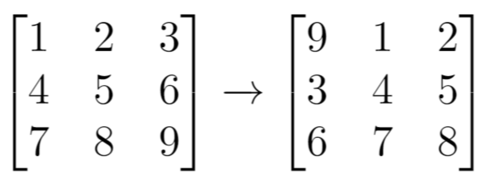

### 1260. 二维网格迁移
> 难度：Easy \
> [原题链接](https://leetcode.cn/problems/shift-2d-grid)

给你一个 `m` 行 `n` 列的二维网格 `grid` 和一个整数 `k` 。你需要将 `grid` 迁移 `k` 次。

每次「迁移」操作将会引发下述活动：

位于 `grid[i][j]` 的元素将会移动到 `grid[i][j + 1]` 。         \
位于 `grid[i][n - 1]` 的元素将会移动到 `grid[i + 1][0]` 。     \
位于 `grid[m - 1][n - 1]` 的元素将会移动到 `grid[0][0]` 。     \
请你返回 `k` 次迁移操作后最终得到的**二维网格**。

示例：

输入：`grid = [[1,2,3],[4,5,6],[7,8,9]], k = 1` \
输出：`[[9,1,2],[3,4,5],[6,7,8]]`
