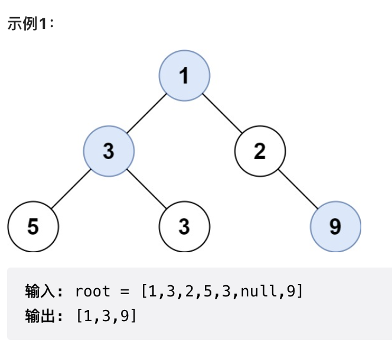

## 508. 出现次数最多的子树元素和
> 难度：Medium \
> [原题链接](https://leetcode.cn/problems/most-frequent-subtree-sum)

给你一个二叉树的根结点`root`，请返回出现次数最多的子树元素和。如果有多个元素出现的次数相同，返回所有出现次数最多的子树元素和（不限顺序）。

一个结点的**子树元素和**定义为以该结点为根的二叉树上所有结点的元素之和（包括结点本身）。

* 节点数在 $[1, 104]$ 范围内
* $-10^5 \leq Node.val \leq 10^5$

